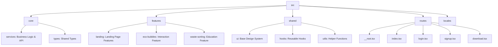

# TichXanh AI — Project Architecture

## Overview

TichXanh AI is a scrollytelling landing page built with **TanStack Start**, **GSAP**, and **Framer Motion**. The project has been refactored to follow **OOP SOLID** principles, ensuring a clean separation of concerns and a modular structure. Recent updates include custom Framer Motion preloader logic, inline SVGs for compatibility, and performance-optimized stats counters.

## Directory Structure (SOLID)

### 1. Core Layer (`src/core`)

Contains the application's heart: business logic, global services (like error handling), and shared TypeScript interfaces.

- **Services:** `error-capture.ts`, `error-page.ts`.
- **Providers:** `TranslationProvider.tsx`.

### 2. Features Layer (`src/features`)

Contains domain-specific components. Each feature is self-contained.

- **Landing:** `HeroSection`, `RealitySection`, `BentoFeatures` (contains `AnimatedCounter` utilizing Framer Motion's `useSpring` and `useInView`), `FounderSection`, `SiteFooter`.
- **Eco-Bubbles:** `FloatingEcoBubbles`.

### 3. Shared Layer (`src/shared`)

Contains reusable cross-feature components and utilities.

- **UI:** `Navbar`, `HackerText`, `Button`, `GlassCard`, and other shadcn-based components.
- **Utils:** `cn` (tailwind-merge wrapper).
- **Hooks:** `use-mobile`.

### 4. Routes (`src/routes`)

Defines the application's file-based routing via `@tanstack/react-router`.

- **`__root.tsx`**: Includes the `GlobalPreloader` component to ensure smooth initialization without unstyled text flashes.
- **`download.tsx`**: Implements custom inline SVG icons (e.g., `GithubIcon`) to avoid outdated package dependencies.

### 5. Locales (`src/locales`)

Centralized English and Vietnamese dictionary for internationalization support.

## Key Technologies

- **Package Manager:** pnpm
- **Framework:** TanStack Start (Vite)
- **Styling:** Tailwind CSS v4 (oklch color space)
- **Animations:** GSAP (ScrollTrigger) & Framer Motion
- **Icons:** Lucide React & Inline SVGs
